# Hello, I'm   Ahmed Rayen! 👋

- 🚀 Hi  i am  [ahmed rayen](https://www.facebook.com/rayen.bouazizi.79/) a passionate self-taught  developer and a freelance software  from tunisia  🇹🇳 , my passion for software lies with dreaming up ideas and making them come true with elegant interfaces. i take great care in the experience, architecture, and code quality of the things I build.

- 📚 I'm currently studying Computer Science Engineering at ESPRIT University in tunisia.
 
- 🗃️ i am also an open-source enthusiast and maintainer. i learned a  ot from the open-source ommunity and i love how collaboration and knowledge sharing happened through open-source.
 
- 🛸 I have a strong interest  in programming and have gained proficiency in several languages including C, C++, C#, Pythonand HTML.

- 😄 I love to build and create. My portfolio includes a diverse set of projects, from developing PC games in c and c++ language  
to creating softwares.

- ✔️ One of my notable projects is a task management software based on the Pomodoro Technique .

- ⚡ I'm always looking for new challenges and opportunities to further expand my skills and contribute  to exciting projects. Feel free to reach out!

- 🌏I've also developed a financial auditing software that aids companies in streamlining their auditing processes.
  
 

- 💼 any freelance work? do reach, [email](mailto:arayen138@gmail.com)        
  
- 💬 ask me about anything, i am happy to help;
               
 

 
 ## 🧰 Languages and tools
   
  
 
  <a href="https://git-scm.com/" target="_blank" rel="noreferrer">
   
    <a href="https://www.oracle.com/" target="_blank" rel="noreferrer">
  
   
   
    <a href="https://git-scm.com/" target="_blank" rel="noreferrer">
   
   
  
 </a>
 

  

 ## 🔰Resume 

 

 ## 📫How to reach me: 
 
 - 
Above are the last 3 pictures posted by <a href="https://www.instagram.com/rayen.feb/" target="_blank"> @rayen.feb</a> 
<h3>Where to find me</h3>

   <a  
                                                                                                                                                                                                                                          

#  📈 my github stats

 
 

# Todoist Stat

